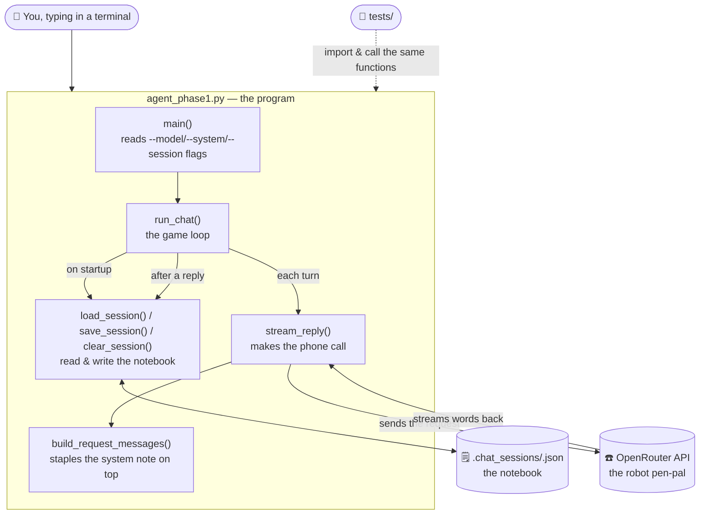
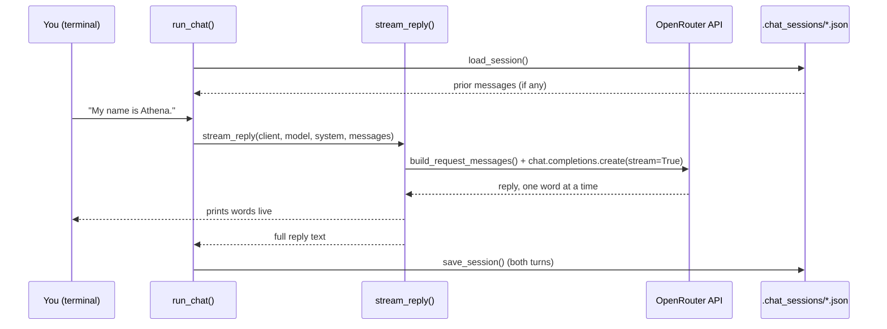
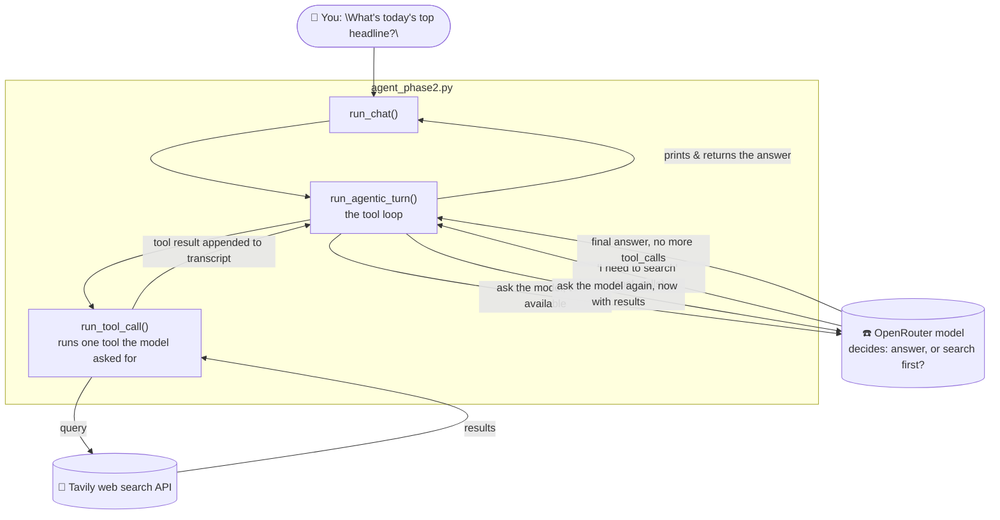

# Agentic AI Project

A stateful CLI chat interface that talks to an LLM via
[OpenRouter](https://openrouter.ai)'s OpenAI-compatible API. Conversation
history is persisted to disk per named session, so a conversation survives
closing and reopening the CLI.

- **Phase 1** (`agent_phase1.py`) — the chat loop and memory.
- **Phase 2** (`agent_phase2.py`) — everything Phase 1 has, plus a
  `web_search` tool the agent can reach for when it needs to answer
  something factual it doesn't already know.

## The 5-year-old explanation

Imagine you have a **magic notebook** and a **robot pen-pal** who lives far
away and only talks on the phone.

1. You write something in the notebook ("My name is Athena.").
2. The notebook is read out loud over the phone to your robot pen-pal,
   **including everything you've ever written before** — that's how the
   robot "remembers" you, even though its brain resets after every call.
3. The robot talks back, one word at a time, and you write its answer in
   the notebook too.
4. You hang up. Next time you call, you read the *whole notebook* to the
   robot again first, so it still remembers you.
5. If the phone line crackles and the call drops, you don't rip up the
   notebook — you just shrug, say "let's try that again," and keep going.

`agent_phase1.py` is the whole story above, written in Python. The
**notebook** is a `.json` file on your computer. The **phone call** is a
request to an AI model through OpenRouter. The **"don't rip up the
notebook"** part is the error handling.

## The big picture (which files do what)



## Meet the functions (all live in `agent_phase1.py`)

| Function | Grown-up job | Kid version |
|---|---|---|
| `main()` | Reads the command-line flags (`--model`, `--system`, `--session`), builds the client, starts the chat loop. | The "start the game" button. |
| `make_client()` | Builds an `openai.OpenAI` client pointed at OpenRouter's web address instead of OpenAI's. | Dials the phone number. |
| `run_chat()` | The REPL loop: reads what you type, handles `/reset` and `/exit`, calls `stream_reply()`, saves the result. | The conductor — runs the whole back-and-forth game. |
| `load_session()` | Reads `.chat_sessions/<name>.json` off disk (or starts empty if it doesn't exist yet). | Opens the notebook to where you left off. |
| `save_session()` | Writes the current conversation back to that `.json` file. | Writes today's chat into the notebook before closing it. |
| `clear_session()` | Deletes the session's `.json` file. | Rips today's page out of the notebook (used by `/reset`). |
| `build_request_messages()` | Puts the system prompt as the first message, ahead of the conversation history. | Staples a sticky-note ("be helpful!") to the front of the notebook before reading it aloud. |
| `stream_reply()` | Sends the messages to the model, prints each word as it streams back, returns the full reply. | Makes the actual phone call and repeats the robot's words out loud as it hears them. |

**Nothing calls the model directly except `stream_reply()`.** Every other
function just manages the notebook (files) or the game loop (input/output) —
that separation is what makes it possible to test the memory logic (below)
without ever picking up the phone.

## The story of one message, step by step

Say you run `python agent_phase1.py --session default` and type
`My name is Athena.`:

1. `main()` calls `make_client()` (dial the phone) then `run_chat()` (start the game).
2. `run_chat()` calls `load_session()` — opens `.chat_sessions/default.json`, finds whatever was saved last time.
3. `run_chat()` prints `You: ` and waits for your keyboard input.
4. You type your message; it gets appended to the in-memory `messages` list — *not saved to disk yet*.
5. `run_chat()` calls `stream_reply(client, model, system, messages)`.
6. `stream_reply()` calls `build_request_messages()` to staple the system prompt on top of the full message list.
7. `stream_reply()` calls `client.chat.completions.create(..., stream=True)` — the actual network call to OpenRouter.
8. As words stream back, `stream_reply()` prints each one immediately and collects them all into one string, which it returns to `run_chat()`.
9. `run_chat()` appends the assistant's reply to `messages`, then calls `save_session()` — *now* it's written to disk.
10. Loop back to step 3 for the next turn.

If step 7 fails (bad key, rate limit, the free model crashing, you hitting
Ctrl+C), `run_chat()` catches it, throws away just the *unfinished* turn
(`messages.pop()`), and either loops back to the prompt or exits cleanly —
whatever was already saved from earlier turns is untouched.



## How the tests fit in

- `tests/test_state_management.py` imports `agent_phase1` and calls its
  functions directly, but swaps in a `FakeClient` instead of a real
  `openai.OpenAI` — so `stream_reply()` runs for real, `build_request_messages()`
  runs for real, `save_session()`/`load_session()` run for real, but no
  actual phone call happens. This is how the "does it remember my name"
  logic gets tested for free, deterministically, every time.
- `tests/test_live_behavior.py` calls the exact same functions but with
  `make_client()`'s *real* client, so it actually phones OpenRouter. It only
  runs if `OPENROUTER_API_KEY` is set.
- `tests/conftest.py` loads `.env` before either test file runs, so the key
  is available when `test_live_behavior.py` decides whether to skip.

## Phase 2: giving the robot a phone book

Your robot pen-pal from Phase 1 only knows what it already learned before
its last "training day" — ask it something that happened last week, or a
fast-changing fact, and it'll either say "I don't know" or (worse) guess.

Phase 2 gives it a **phone book**: a `web_search` tool it's allowed to use
mid-call. Now the conversation can go:

1. You ask something factual.
2. The robot thinks "I'm not sure, let me look that up" and, *instead of*
   answering you, says "hang on" and looks up your question in the phone
   book (a real web search).
3. It reads the search results, thinks about them, and *then* answers you
   — grounded in what it just looked up, instead of guessing.
4. For things it already knows cold (like `2 + 2`), it just answers
   directly and skips the phone book — searching is a choice it makes, not
   something that happens on every message.



**Functions added in `agent_phase2.py`** (imports `make_client`,
`load_session`, `save_session`, `clear_session`, `build_request_messages`
straight from `agent_phase1.py` — no need to reinvent the notebook):

| Function | Grown-up job | Kid version |
|---|---|---|
| `WEB_SEARCH_TOOL` | The schema describing the `web_search` tool to the model: its name, when to use it, what arguments it takes. | The label on the phone book that says "look things up here." |
| `tavily_search()` | Calls the real Tavily search API over HTTP and returns raw results. | Actually flips open the phone book. |
| `format_search_results()` | Turns raw search results into a short readable text block. | Reads out the phone book entry in plain words. |
| `run_tool_call()` | Runs one tool the model asked for, catching failures (bad key, network error, unknown tool name) so they get reported instead of crashing. | Hands the robot the answer it asked for — or says "couldn't find that page" instead of hanging up on you. |
| `run_agentic_turn()` | The loop: ask the model → if it wants to search, search and ask again → repeat until it gives a real answer (capped at 4 tries so it can't loop forever). | The whole "hang on, let me check... okay, here's your answer" exchange. |
| `run_chat()` | Same REPL as Phase 1's, but calls `run_agentic_turn()` instead of `stream_reply()`, and rolls back the *whole* turn — user message, any searches, everything — if something breaks partway through. | The conductor again, just now the game has an extra "maybe look it up" step. |

Notice `stream_reply()` isn't used here. Deciding *whether* to search
needs a clean, structured answer from the model ("yes, call this tool,
with these arguments") — that comes back as one clean JSON blob per
request, not as words trickling in one at a time, so Phase 2's calls to
the model aren't streamed the way Phase 1's are. Only the *final* answer
(once no more searching is needed) gets printed.

### How the Phase 2 tests fit in

- `tests/test_tool_calling.py` — a scriptable fake "model" that can be told
  "pretend you want to search" or "pretend you already know the answer,"
  so the tool loop, search-failure handling, unknown-tool handling, and
  the max-retry cutoff are all tested without any real network call.
- `tests/test_live_tool_calling.py` — the same idea against the real model
  and real Tavily search; needs both `OPENROUTER_API_KEY` and
  `TAVILY_API_KEY`.

## Setup

1. Install [uv](https://docs.astral.sh/uv/) if you don't already have it.
2. `uv sync`
3. Create a `.env` file in the project root containing:
   ```
   OPENROUTER_API_KEY=your-key-here
   TAVILY_API_KEY=your-key-here
   ```
   `OPENROUTER_API_KEY` is required for both phases. `TAVILY_API_KEY` (free
   tier at [tavily.com](https://tavily.com)) is only needed for Phase 2's
   `web_search` tool — Phase 1 runs fine without it.

> **Note:** this project's OpenRouter account currently has no purchased
> credits, so paid models will fail with a 402 error. Stick to `:free`
> models (like the default) unless you've added credits.

## Usage

```
uv run python agent_phase1.py [--model MODEL] [--system "system prompt"] [--session NAME]
uv run python agent_phase2.py [--model MODEL] [--system "system prompt"] [--session NAME]
```

- `--model` defaults to `nvidia/nemotron-3.5-lightning:free` for both phases
  (confirmed to support tool calling for Phase 2, at no cost).
- `--system` sets the system prompt (Phase 2's default nudges the model to
  use `web_search` for current/uncertain facts and skip it otherwise).
- `--session` defaults to `default`. Each session name gets its own history
  file at `.chat_sessions/<name>.json` (gitignored — this is the agent's own
  memory, not tracked in version control). Phase 1 and Phase 2 share the
  same `.chat_sessions/` directory, so running both against `--session
  default` continues the same conversation either way.
- Type `/reset` to clear the current session's history, `/exit` or Ctrl+C to quit.

## Testing

```
uv run pytest                  # mocked, deterministic, no network or token cost
uv run pytest -m integration   # live calls against real OpenRouter / Tavily (needs the API key(s))
```

Phase 1 tests cover session persistence (save/load/reset, isolated named
sessions), correct request construction, and a PASS/FAIL behavioral pair —
the agent must recall a name stated earlier in the conversation ("My name
is Athena" → "What is my name?" → recalls "Athena") but must *not*
fabricate an answer when that context is missing.

Phase 2 tests add their own PASS/FAIL pair for the search tool — the agent
must search when it doesn't know something, but must *not* waste a search
call on something it already knows (like `2 + 2`) — plus coverage for a
broken search backend, an unknown tool name, and runaway tool-call loops.
Each pair is tested both offline (mocked model/search) and live against
the real APIs.

## Project layout

- `agent_phase1.py` — the base CLI chat implementation: client, sessions,
  streaming replies, the REPL.
- `agent_phase2.py` — imports Phase 1's client/session helpers and adds the
  `web_search` tool-calling loop on top.
- `tests/test_state_management.py` — mocked unit tests for Phase 1's
  session persistence and stateful behavior.
- `tests/test_live_behavior.py` — live integration tests for Phase 1
  against the real model (opt-in, requires `OPENROUTER_API_KEY`).
- `tests/test_tool_calling.py` — mocked unit tests for Phase 2's
  web-search tool loop.
- `tests/test_live_tool_calling.py` — live integration tests for Phase 2
  against the real model and real Tavily search (opt-in, requires both API
  keys).
- `tests/conftest.py` — loads `.env` before test collection, so the live
  tests correctly detect the API key(s) and run instead of skipping.
- `.chat_sessions/` — persisted conversation history per session (gitignored).
- `src/agentic_ai_project/` — unused scaffold left over from `uv init`, not
  part of either phase.

See [CLAUDE.md](CLAUDE.md) for architecture notes and a running log of the
decisions and fixes made so far.
